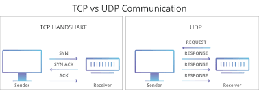

# Assignment 4 

# Part 1 - Networking

> "Putting it all together"

*The year is 2004 and your manager's eyes are glued to the computer screen.*

*"Social media. Web 2.0. This, is the future. I like it. I like the Facebook. Clever idea, very clever idea." the manager states. "We need to add some sort of social component to our painting app. We'll call it, 'paint nite - a social collaborative painting applation,'--yes, I very much like the sound of my own ideas*

*"Ahem", you clear your throat, "Maybe we should instead start simple, you know, define some of the requirements? We can incorporate some of the networking code we have written?"*

*The manager blinks his eyes twice and disappears*

*Who is the manager you wonder?*

# Resources to help

Provided below are a list of curated resources to help you complete the task(s) below. Consult them (read them, or do ctrl+f for keywords) if you get stuck.

1. For Task 1 - Networking
	- Nice F.A.Q. on network programming with SFML (Recommended reading)
		- https://www.sfml-dev.org/faq.php#network-create-network-app
	- Packets in SFML
		- https://www.sfml-dev.org/tutorials/2.5/network-packet.php

# Task 1 - Networking

In your previous lab you have learned how to create a networked application. Now it is time to combine what we have learned in our previous labs and assignments and build a collaborative painting program.

Our goal is to be able to have multiple clients (at least 3) connect to a server application which will broadcast changes to each user as they paint.

### Design considerations

- Multiple users will be editing different or the same piece of a canvas.
	- Think about how you want to structure 'packets' of data being sent from client to server and vice versa.
	- Think about what data structures you might want to use to store this data.
- If a client leaves, the server should not crash.
- If the server is closed, clients should still be able to paint, but without any other clients modifying the painting.

## Requirements Analysis (Your Task)

1. Integrate assignments 1-3 together.
	- A1's main feature was to have a working SFML application.
	- A2's main feature was the undo/redo system
	- A3's main feature was to have testing with the Catch2 framework.
	- A4's main feature is to have a server which multiple clients can connect to collaboratively paint on the same canvas.
		- The IP address and port# should not be hard-coded anywhere in the application. (Prompt the user for input)
		- At least 3 users should be able to paint at once.
2. Integrate the following labs
	- From your lab 7 you should have a GUI window where you can change colors that you draw in
	- From your lab 8, you should have a networked application.

### Advice

Start small. It is likely you can start from A3 and slowly integrate the lab features into your assignment.

## Testing

- Task 1
	- You should be able to use your [CMakeLists.txt](./CMakeLists.txt) file to generate a build file that can compile the code provided in the source directory.
	- We should be able to launch a server and a client application and connect on the local host.

# Submission/Deliverables

- Git add/commit/push your [CMakeLists.txt](./CMakeLists.txt) file.

### Submission

- Commit all of your files to github, including any additional files you create.
- Do not commit any binary files unless told to do so.
- Do not commit any 'data' files generated when executing a binary.

### Deliverables

- Task 1
	- A client/server where users can paint. All previous features of A1-A3 should be incorporated.

# Rubric
 
  <table>
  <tbody>
    <tr>
      <th>Points</th>
      <th align="center">Description</th>
    </tr>
    <tr>	  
      <td>30% (Task 1 - Polish)</td>
	<td align="left"><ul><li>Does your CMakeFile generate a makefile/xcodeproject/visualstudio project/etc. that compiles?</li><li>Did you structure your networking code in a reasonable, object-oriented manner?</li></ul></td>
     </tr>
     <tr>
	<td>40% (Task 1 - Integration)</td>
	<td align="left"><ul><li>Were your previous assignments incorporated into this one successfully? (i.e. if we just launched a server and one client, would the program behave as normal?)</li></ul></td>
    </tr>	     
      <td>30% (Task 1 - Networking)</td>
	<td align="left"><ul><li>Do you have an application that meets the requirements listed above? (3 clients can paint at once, clients can disconnect without crashing the server, etc?)</li></ul></td> 
    </tr>
  </tbody>
</table>

* Note: You must also commit any additional files into your repository so we can test your code.
  * Points will be lost if you forget!

# Going Further

An optional task(if any) that will reinforce your learning throughout the semester--this is not graded.

1. Start thinking of additional features you would like to add!

# F.A.Q. (Instructor Anticipated Questions)

1. Q: How do we handle undo?
	- A: Undo should undo the last command a user did and send that action to the server. Note, that if a user paints on top of a pixel that you are undo'ing the operation on, your change will override there change. This is fine behavior.
2. Q: Can I change this to be a peer-peer applciation or otherwise change the structure of the networked code?
	- A: Sure, so long as at least 3 clients can paint at the same time.
3. Q: Does your instructor enjoy painting?
	- A: Yes, but I am not very good. The following below is a recent experiment of something called a Dutch Pour. You use a hair dryer and a blow torch over acrylic paints.
	- 

