# Loi Truong's Personal Website

## Description
The personal website showcases my biography, my resume, my photography works and also includes a link to my GitHub, as well as my social media, and a functional contact form. 

Link: https://loi-truong-personal-website.herokuapp.com/

## Screenshots
### Landing page

### Biography page
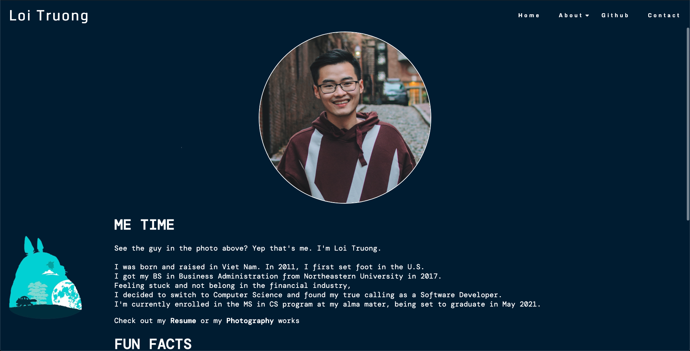

### Resume page
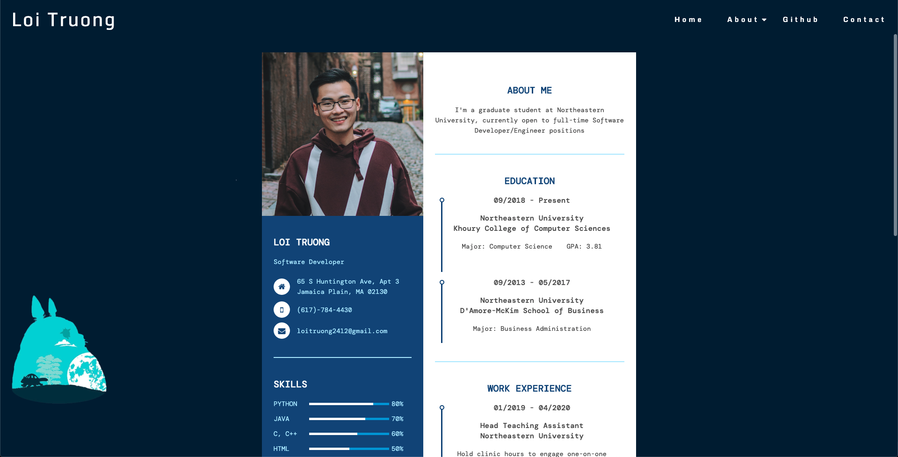

### Photography page
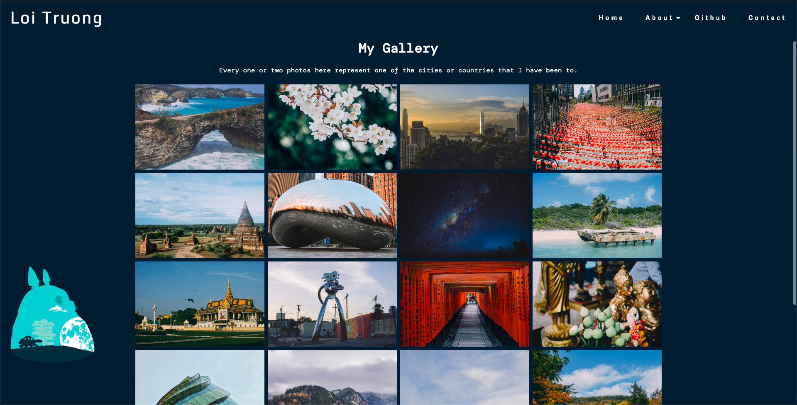

### Contact page
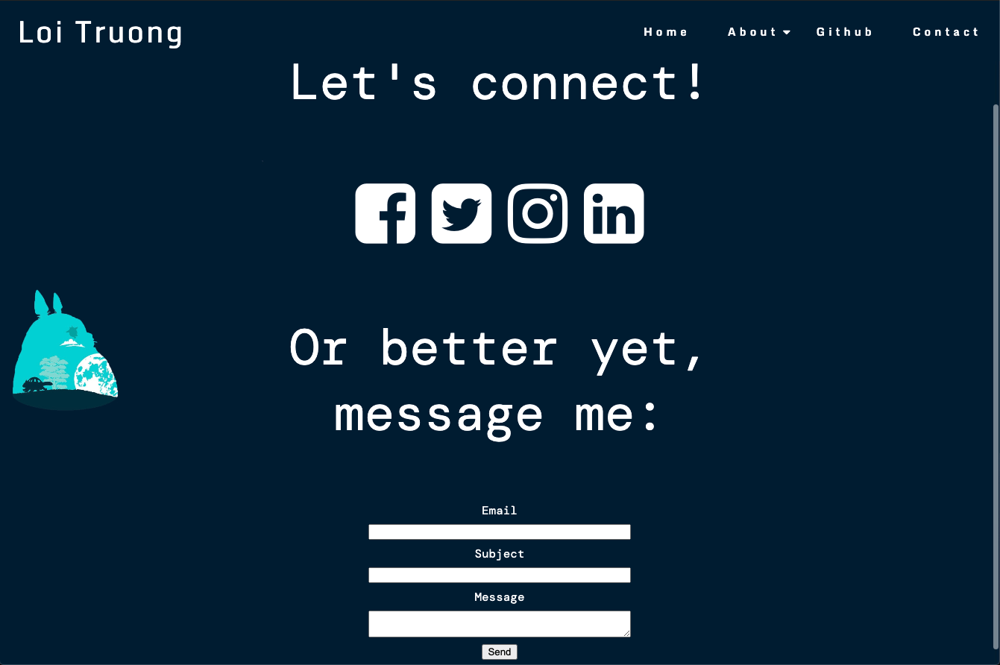

## Criteria met
1. A landing page

   When accessing the link https://loi-truong-personal-website.herokuapp.com/, users will be taken to the landing page, which is shown in one of the screenshots above. When exploring anywhere on the site, the users can always go back to the landing page by clicking on **Home** in the navigation bar or on **Loi Truong** in the top left corner. I did not want to be too obvious annd state that "This is my personal website". All the images and introduction lines on the landing page are subtle enough for the users to look at and know that this is a website about myself.  

2. One or more navigational elements 

   The website has a navigation bar that makes it easier for the users to navigate around. The **About** table has a sub-navigation bar. There is no dead end and the users do not need to rely on the browser's navigation buttons to get to where they want to go to.

   When the window is resized, the navigation bar does not roll out of sight or disappear. More about the responsiveness will be discussed below.  

   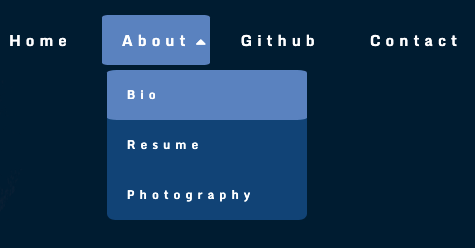

3. Two or more internal links

   The navigation bar contains some tabs that are internal links: **Home**, **Bio**, **Resume**, **Photography**, **Contact**, which means when clicked on, they will open their content in the same browser tab. 

   Additionally, within the **Bio** page, the users can also click on one of the *Resume* or *Photography* hypertext to get to those pages.

     

4. One or more external links

   Examples of external links are: **Github** in the navigation bar which takes the user to my Github that stores my academic projects, the social media links in **Contact**. These external links open new browser tabs and leave the current site remain open. 

   
   

5. One or more html table

   *Fun Facts* section is organized using a table with css styling. The table is also responsive to the window size.

   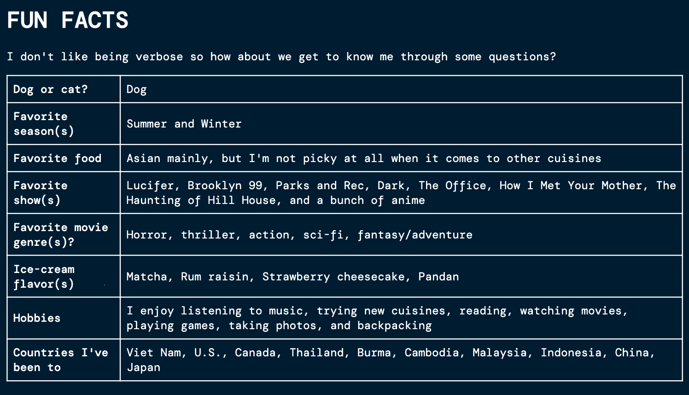  

6. One or more interactive/animated component

   a. The codes for the navigation bar are stored in a javascript file and shared among other html files to reduce code redundancy. jQuery is used to make the navigation bar more interactive and responsive to different screen sizes. When screen size is less than 720px, the original navigation links are hidden and the toggle button appears. When clicked on, the toggle button makes the new navigation links appear. 

   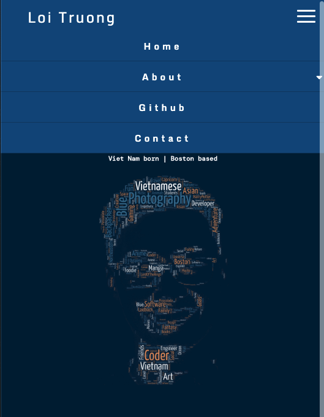
   
   b. The new navigation links are mobile-friendly. For tabs that have sub-menu, there is a small triangle next to the tab, which indicates this tab has a sub-menu. When clicked on, the sub-menu is shown and the triangle is flipped using jQuery.

   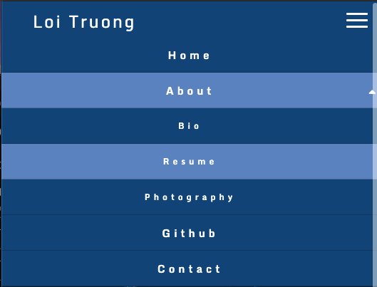  
   
   c. jQuery is also used to make the contact form functional, including validating field values. When filling out the contact form, the users have to use valid values in order to make the form work. Ex: *Email* needs to be in valid form and have 5 or more characters, *Subject* needs to have more than 1 character, and *Message* needs to have 10 or more characters.

   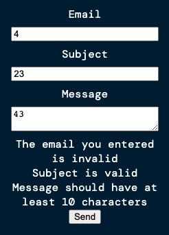     

7. Responsiveness

   Here are the screenshots of the pages when viewed on a mobile device. 

   
   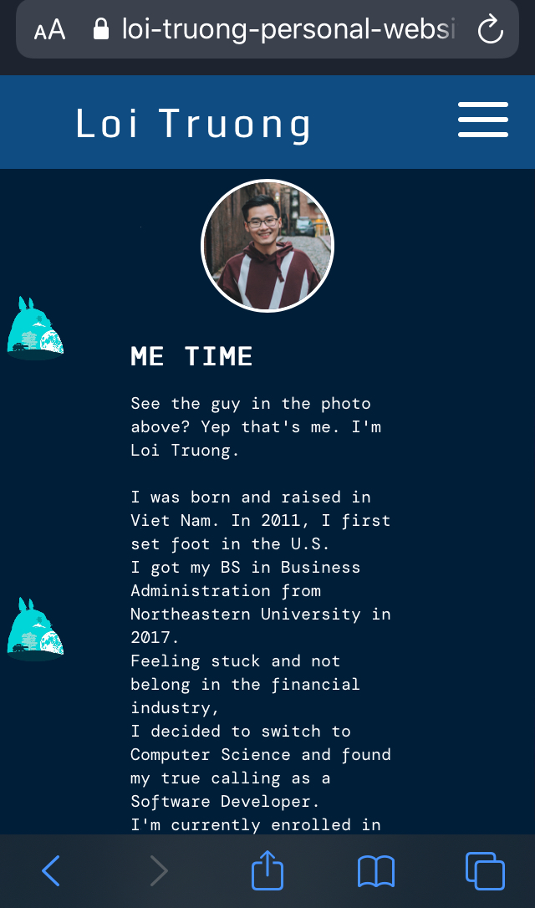
   
   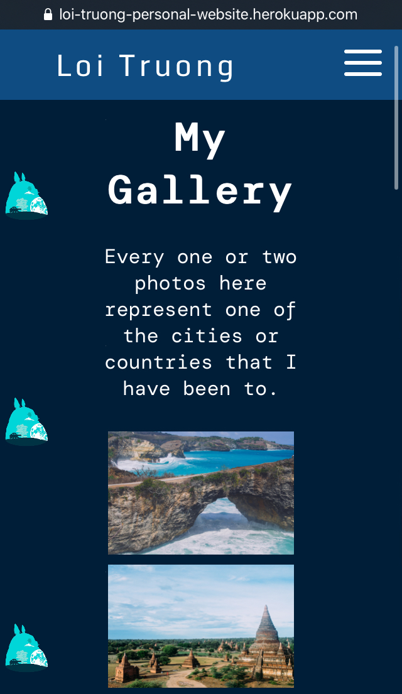
   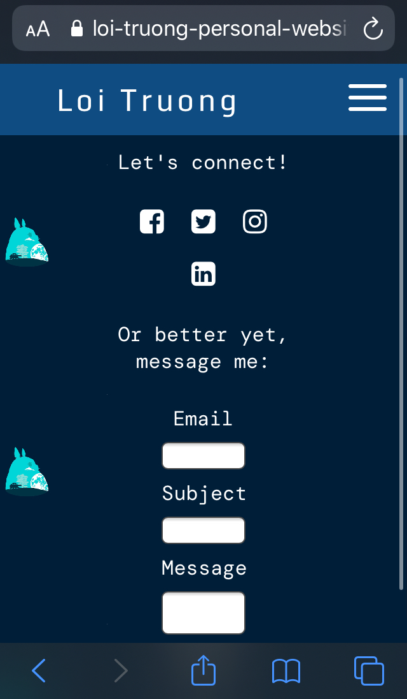